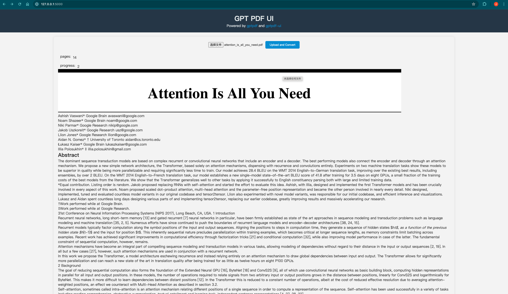

# gptpdf ui

[gptpdf](https://github.com/CosmosShadow/gptpdf)



## install dependencies

```shell
pip install -r requirements.txt
```

## set openai key

```shell
export OPENAI_BASE_URL=https://api.xxxx.com/v1
export OPENAI_API_KEY=sk-xxxxx
```

## start serve

```shell
python main.py
```

or

```shell
flask --app main.py run
```

## docker

```
docker compose up --build

docker compose up
```

## api

- `/upload` response pdf conent with sse

- `/files/<path:filename>`  response pdf content with html

- `/md/<path:filename>`  response pdf content with md
